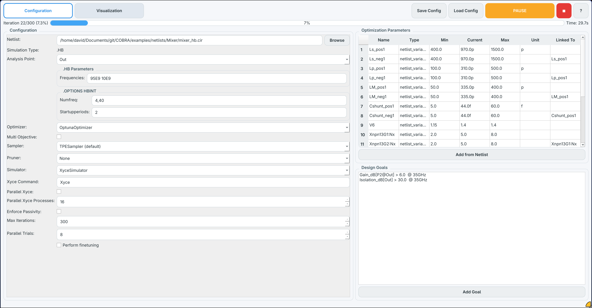
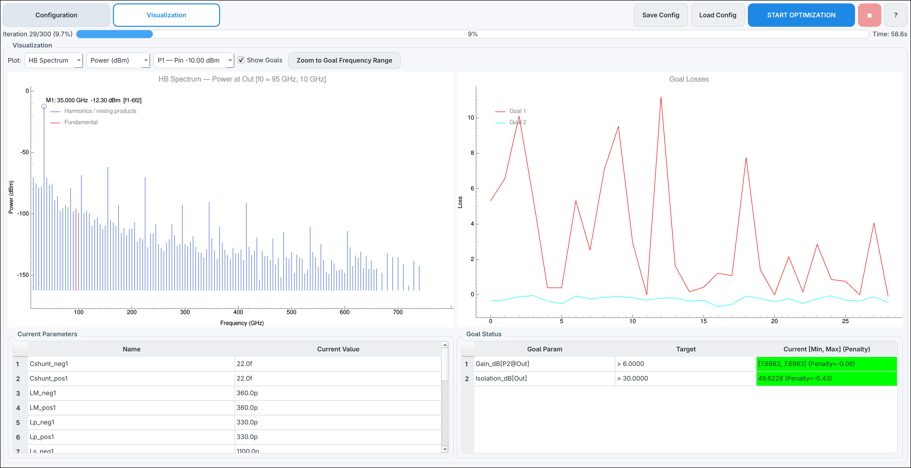

# COBRA - A Circuit-Level Open-Source Based RFIC AI-Assisted Optimizer
[](https://di-passionate.github.io/COBRA/)

©2026 

Gianluca Simone\*, David Lurz\*, Martin Grund\*, Fabian Schneider°, Michael Loose\*, Sascha Breun\*, Manuel Koch\*, Robert Weigel\*, Norman Franchi\*

\* Institute for Intelligent Electronics and Systems (LITES), Friedrich-Alexander-Universität (FAU), Erlangen-Nürnberg, Germany

° Chair of Integrated Electronic Systems, Otto-von-Guericke-University Magdeburg, Germany

[Paper (Coming Soon)](#cite-this-work) | [Documentation](https://di-passionate.github.io/COBRA/) | [BibTex](#cite-this-work)

> [!NOTE]
> COBRA is still under active development, and the paper is yet to be released. The current codebase is functional and can be used for experimentation, but we keep adding features, improving documentation, and refining the API. If you encounter any issues or have questions, please [open an issue](https://github.com/DI-PASSIONATE/COBRA/issues) or reach out.

**COBRA** is an optimization framework for RFIC workflows.
It combines:

- surrogate-model S-parameter prediction (from [ORCA](https://github.com/DI-PASSIONATE/ORCA)-generated ONNX models or fixed Touchstone SNP files),
- circuit-level SPICE simulation via Xyce,
- and goal-driven optimization (Optuna-based).

You can easily define goals and configurations in the GUI:



and visualize optimization progress in real time:



## How COBRA Fits with ORCA

COBRA is the optimization/runtime side of the flow.

- [ORCA](https://github.com/DI-PASSIONATE/ORCA) creates the surrogate model (for example, `tf_octa_c_ports.onnx`) from EM simulation data.
- COBRA loads that ONNX model and predicts S-parameters during optimization loops.
- Optional fine-tuning in COBRA can call full-wave EM simulations (Palace) and uses [ORCA](https://github.com/DI-PASSIONATE/ORCA) geometry classes (preset or custom).

In short: [ORCA](https://github.com/DI-PASSIONATE/ORCA) builds the model, COBRA uses it to optimize circuits quickly and can verify/refine with EM fine-tuning.

## Installation
### Requirements

- Python 3.11+
- [Xyce](https://xyce.sandia.gov/) (current circuit simulator backend)
- [Qucs-S](https://qucs-s-help.readthedocs.io/en/latest/) (to create a '.cir' netlist for Xyce)
- A component model source per parsed component:
    - [ORCA](https://github.com/DI-PASSIONATE/ORCA)-generated surrogate ONNX model (`.onnx`) for optimizable geometry/model inputs, or
    - fixed Touchstone file (`.sNp`, e.g. `.s2p`, `.s4p`, `.s6p`) for non-optimizable components

Optional:

- [AWS Palace](https://awslabs.github.io/palace/stable/), if you want EM fine-tuning
- [ORCA](https://github.com/DI-PASSIONATE/ORCA) installed/importable in your Python environment if you use ORCA geometry presets/classes in scripts or GUI fine-tuning

### Option A: Using `uv` (recommended)

1. Clone the repository:

```bash
git clone https://github.com/DI-PASSIONATE/COBRA
cd COBRA
```

2. Install `uv` (if needed):

```bash
curl -LsSf https://astral.sh/uv/install.sh | sh
```

3. Install a supported Python version:

```bash
uv python install 3.13
```

4. Create and activate a virtual environment:

```bash
uv venv --python 3.13
source .venv/bin/activate
```

5. Install COBRA in editable mode:

```bash
uv pip install -e .
```

### Option B: Using standard `venv` + `pip`

1. Clone the repository:

```bash
git clone https://github.com/DI-PASSIONATE/COBRA
cd COBRA
```

2. Create and activate a virtual environment:

```bash
python3 -m venv .venv
source .venv/bin/activate
```

3. Install COBRA:

```bash
pip install -U pip
pip install -e .
```

## Running COBRA

COBRA supports three main usage modes.

Technically, fully GUI-free usage through Python code is supported and works well for scripted workflows, CI, and reproducible experiments. For most users and day-to-day interactive optimization, the GUI is still highly recommended.

### 1. GUI mode

After installation, start the GUI with:

```bash
cobra
```

The GUI lets you:

- load a netlist and map each parsed subcircuit component to either an ONNX surrogate model or a fixed SNP Touchstone file,
- configure optimization parameters and design goals,
- run/pause/stop optimization,
- visualize S-parameters, harmonic-balance output spectra, and goal losses in real time,
- optionally enable EM fine-tuning with Palace and select ORCA geometry presets or custom geometry classes.
- browse, download, and use community surrogate models directly from HuggingFace.

For a more detailed walkthrough of the GUI features, see the [GUI User Guide](#gui-user-guide) section below or [visit the documentation](https://di-passionate.github.io/COBRA/).


### 2. Python script mode

Use the provided example:

```bash
python examples/main.py
```

The example in `examples/main.py` shows how to:

- parse `netlist_multiple_SPFiles.cir` with `XyceNetlistParser`,
- map `X1` to an ONNX surrogate and `X2` to a fixed Touchstone SNP file,
- optimize prefixed model inputs for `X1` (for example `X1:bottom_winding_diameter`),
- optimize parsed netlist values `Cshunt_p` and `Cshunt_n` with `linked_to`,
- configure `OptunaOptimizer` and `XyceSimulator`,
- run `cobra.run(...)` with optional ORCA geometry (`TransformerOcta`). The ORCA geometry is only required for finetuning.

### 3. JSON configuration and CLI mode

The GUI has **Save Config** and **Load Config** buttons for reproducible runs. A
saved configuration restores the netlist, component models, simulation settings,
optimizer and simulator options, optimization parameters, goals, and optional
fine-tuning settings.

Run the same configuration without opening the GUI:

```bash
cobra run path/to/cobra_config.json
```

Check a configuration or a netlist before starting a run:

```bash
cobra parse path/to/cobra_config.json
```

The report lists the parsed netlist, ports, surrogate components, goals, and
tunable variables, and cross-checks the configuration against the netlist it
references (missing model mappings, unresolvable optimization parameters,
unavailable HB nodes, missing include or library files). It exits with `2` when
it finds an error that would stop a run.

Relative netlist, model, and custom geometry paths are resolved from the directory
containing the JSON file. Every GUI or CLI run also archives its exact input as
`cobra_config.json` inside the timestamped results directory. This input file is
separate from `cobra_optimization_context.json`, which contains run history and
results.

See the [JSON Configuration Guide](https://di-passionate.github.io/COBRA/user-guide/configuration/)
for the schema and a complete example.

## GUI User Guide
Coming soon

### Using the HuggingFace Model Browser

The GUI includes a built-in browser for ORCA surrogate models shared on HuggingFace. How to upload your own models to HuggingFace and make them discoverable in COBRA is covered in ORCA's documentation, but the basic convention is to tag your HuggingFace repo with `orca-surrogate` and include the required files (`<repo>.onnx` and optionally `<repo>.py`).
Each component selector row in the configuration panel has a **HuggingFace** button next to the standard Browse button.

**Browsing and downloading a model:**

1. Click **HuggingFace** for any component.
2. The dialog opens and immediately shows any models you have already downloaded (marked `[LOCAL]`) at the top of the list.
3. While the list loads, public models tagged `orca-surrogate` on HuggingFace are fetched in the background and appended once available, sorted by download count.
4. Select a model to see its details on the right (owner, downloads, likes, tags, description, and whether EM fine-tuning is available).
5. If the model is not yet local, click **Download** — the repo is saved to `./models/<owner>/<repo>/`.
6. Once downloaded (or if already local), click **Use** to populate the component's file field with the path to `<repo>.onnx`.

**File convention for shared models:**

COBRA expects each HuggingFace repo to contain at least two files:

| File | Purpose |
|------|---------|
| `<repo>.onnx` | The ORCA-generated surrogate model
| `<repo>.py` | The ORCA geometry class for EM fine-tuning

If the geometry class file is missing, COBRA will disable fine-tuning for that model and show a warning in the details panel. This allows sharing surrogate models e.g. for the default components included with ORCA.

**Using a downloaded model in scripts:**

Downloaded models land in `./models/<owner>/<repo>/` relative to the working directory.
You can reference them directly in Python scripts:

```python
import os
cobra = COBRA(
    netlist_parser=parser,
    component_onnx_mapping={
        "X1": "models/UserA/my_transformer/my_transformer.onnx",
    },
    ...
)
```

## Capabilities

### Design parameters

Small-signal parameters, derived from the `.AC` S-parameter result:

| Parameter | Description |
|-----------|-------------|
| `S11_dB`, `S21_dB`, `S31_dB`, `S41_dB`, `S12_dB`, `S22_dB` | S-parameters in dB |
| `Lp`, `Ls` | Primary / secondary inductance (nH), derived from mixed-mode Z-parameters |
| `Rp`, `Rs` | Primary / secondary series resistance (Ω) |
| `Qp`, `Qs` | Primary / secondary quality factor |
| `k` | Magnetic coupling coefficient |
| `SRF` | Self-resonance frequency (GHz) |

Large-signal parameters, derived from the `.HB` result (see [Harmonic Balance Support](#harmonic-balance-support)). These are generated per netlist, so `<node>` and `<port>` are the names found in your circuit:

| Parameter | Description |
|-----------|-------------|
| `Power_dBm[<node>]` | Output power in dBm at the selected analysis point |
| `Gain_dB[<port>@<node>]` | Transducer gain in dB at `<node>`, referred to the drive level of input port `<port>` |

Each goal accepts an optional `frequency_range` string (e.g., `"125-135ghz"`), a `min_value`, a `max_value`, and a `weight`. For HB goals a single frequency such as `"35ghz"` selects the corresponding spectral line.

### Optimizer options

`OptunaOptimizer` wraps [Optuna](https://optuna.org) and supports:

- **Samplers**: `"tpe"` (default, Bayesian), `"random"`, `"simulated_annealing"`, `"auto"` (requires `optunahub`)
- **Pruners**: `None` (default), `"median"`, `"successive_halving"`, `"hyperband"`
- **Multi-objective mode**: set `multi_objective=True` to optimize for a Pareto front instead of a single aggregated loss

For EM fine-tuning, a `GradientDescentOptimizer` is also available by passing `fine_tuning_optimizer="gradient_descent"` to `COBRA`.

### Optimization parameter types

| `OptimizationType` | What it controls |
|--------------------|-----------------|
| `MODEL_INPUT` | Geometry parameter fed directly to the ONNX surrogate model |
| `NETLIST_VARIABLE` | Parsed netlist element values/parameters (for example component values like `C1 0F` or instance/model params) patched directly in the netlist |

Parameters can be linked (`linked_to="other_param"`) so that one variable always mirrors another, useful for symmetrically constrained components.

## Harmonic Balance Support

S-parameters only describe small-signal behaviour. For large-signal designs — power amplifiers, mixers, anything where compression or mixing products matter — COBRA can optimize against a Harmonic Balance (`.HB`) analysis instead of, or in addition to, the `.AC` sweep.

### Netlist requirements

A Qucs-S schematic with a Harmonic Balance simulation block exports the three directives COBRA needs:

```spice
.options hbint numfreq=3 STARTUPPERIODS=2
.HB 130G
.PRINT hb format=csv I(VOut) v(Out) v(Vdd) v(ip) v(on) v(op) v(sub)
```

- `.HB` lists the **fundamental frequencies**. One token is a single-tone analysis (LNA, PA); several tokens make it multi-tone (`.HB 95E9 10E9` for a mixer), and Xyce then solves for all mixing products of those tones.
- `.options hbint numfreq=…` sets the number of harmonics per fundamental (`numfreq=4,40` assigns a different count to each tone).
- `.PRINT hb …` determines which signals end up in the result file.

Both the `.HB` frequencies and the `.options hbint` values are editable in the GUI under **Simulation Parameters** once a netlist is loaded, so you can sweep the harmonic settings without touching the schematic.

### Analysis points

Output power needs both a voltage and a current. The Qucs-S convention is a labelled node with a 0 V source used as a current probe in series with it:

```spice
VOut Out _net6 DC 0
```

This yields the pair `V(Out)` and `I(VOut)`. COBRA scans the `.PRINT hb` line and offers every node that has **both** halves of such a pair in the **HB Analysis Point** dropdown in the configuration panel. The selected node is what the HB design parameters and the spectrum plot refer to.

### Goals

Once a netlist with an HB analysis is loaded, `Power_dBm[<node>]` and one `Gain_dB[<port>@<node>]` per driven port appear in the goal dialog. A goal such as `Power_dBm[Out] > 10` with a frequency range of `35ghz` constrains exactly the 35 GHz line of the output spectrum, which is how you express a mixer conversion target.

AC and HB goals can be mixed freely. COBRA determines which analyses are required, generates one netlist per analysis type, runs them, and combines the resulting penalties in a single loss. If a goal needs an analysis the netlist does not contain, the missing directive is injected automatically — including a matching `.PRINT HB format=csv` line, without which Xyce would produce no HB output at all.

### Spectrum visualization

During optimization the visualization panel plots the output spectrum of the selected analysis point as a stem plot:

- **Quantity** — output power (dBm), gain (dB) against a selectable input port, node voltage (dBV), or probe current (dBmA).
- **Fundamentals** are highlighted in a separate colour from the remaining lines.
- **Click any line** to drop a marker labelled with its frequency, value, and harmonic index — `H2` for a single-tone analysis, or the mixing-product decomposition such as `2f1-f2` for multi-tone, so unwanted products are easy to identify when tuning for isolation.

When both an `.AC` and an `.HB` analysis run, a selector switches the left plot between the S-parameters and the HB spectrum; when only one of them is active, that plot is shown and the selector is disabled.

> [!NOTE]
> Transient (`.TRAN`) analyses are parsed and can be simulated, but time-domain spectrum plotting is not implemented yet.

## Typical Inputs and Outputs

Inputs:

- circuit netlist `.cir` / `.sp` (Qucs-S / Xyce format)
- one or more component model files: ORCA-generated ONNX (`.onnx`) and/or fixed Touchstone (`.sNp`)
- design goals and optimization parameter definitions

Results are saved to a timestamped folder `results/<timestamp>_<netlist_name>/` and include:

- `cobra_optimization_context.json` — full optimization history and best parameters
- `<component>_predicted.s<N>p` — surrogate-predicted Touchstone files per component
- `surrogate_s_params_<component>.s<N>p` — best-trial surrogate S-parameters
- `<netlist>.HB.FD.csv` / `.HB.FD.prn` — harmonic-balance frequency-domain results, when an HB analysis is run
- vector-fitted SPICE subcircuits (`<component>.sp`) included by the final netlist

## EM Fine-Tuning Notes (Optional)

If you enable fine-tuning:

- pass `palace_fine_tuning_command` to `COBRA` (or enable it in the GUI),
- provide an ORCA geometry object via `orca_geometry=` in `cobra.run(...)`,
- choose `fine_tuning_optimizer="reuse"` to continue with the surrogate optimizer, or `"gradient_descent"` to switch to gradient descent for the fine-tuning phase,
- COBRA will generate a GDS file, mesh it with gmsh, run a full Palace EM simulation, and iterate.

## How COBRA Works Internally

COBRA runs a staged pipeline on each optimization iteration. Understanding each stage clarifies why certain design choices were made.

```
┌──────────────────────────────────────────────────────────────────────┐
│                          COBRA run loop                              │
│                                                                      │
│  ┌──────────────┐   new params   ┌─────────────────┐                 │
│  │  Optimizer   │───────────────▶│ Netlist Parser  │ (patch .cir)    │
│  │  (Optuna)    │                └────────┬────────┘                 │
│  └──────┬───────┘                         │ updated netlist          │
│         │ tell(penalties)                 ▼                          │
│         │                       ┌─────────────────┐                  │
│         │                       │  EM Surrogate   │ (ONNX inference) │
│         │                       │  Stage          │                  │
│         │                       └────────┬────────┘                  │
│         │                                │ rf.Network per component  │
│         │                                ▼                           │
│         │                       ┌─────────────────┐                  │
│         │                       │  Circuit Sim    │ (vector fit →    │
│         │                       │  Stage          │  Xyce)           │
│         │                       └────────┬────────┘                  │
│         │                                │ simulated rf.Network      │
│         │                                ▼                           │
│         └───────────────────────┌─────────────────┐                  │
│                                 │  Design Goal    │                  │
│                                 │  Checker        │                  │
│                                 └─────────────────┘                  │
└──────────────────────────────────────────────────────────────────────┘
```

### Stage 1 — Optimizer (`OptunaOptimizer`)

Optuna's sampler proposes the next set of parameters (geometry inputs and/or netlist variables). After each iteration the checker's penalty values are fed back via `tell()`, so the sampler can learn the landscape. TPE (Tree-structured Parzen Estimator) is the default because it works well with a small number of evaluations — exactly what is needed when each evaluation involves a circuit simulation.

### Stage 2 — Netlist parsing and patching (`XyceNetlistParser`)

Before each simulation the netlist is updated in two ways:

1. **Parsed netlist elements** (`NETLIST_VARIABLE` parameters) are patched directly in the `.cir` text (for example R/C/L values and supported instance/model parameters) so Xyce picks them up.
2. **TSTONEFILE rewriting** — Qucs-S exports Touchstone references as `YLIN` devices with a `.MODEL … LIN TSTONEFILE=…` directive. Xyce cannot parse this syntax, and more importantly SPICE simulators in general cannot use a raw Touchstone file as a subcircuit. The parser detects these blocks and rewrites them into normal `X…` subcircuit instances that point to the vector-fitted `.sp` file that will be generated in Stage 3.

### Stage 3 — EM surrogate inference (`EMSurrogateStage`)

The ONNX model (produced by ORCA) receives the current geometry parameters and a fixed frequency sweep (1 GHz–200 GHz, 1 GHz steps) as inputs. It returns the real and imaginary parts of each S-parameter entry, which are assembled into a `scikit-rf` `Network` object.

ONNX was chosen because it is a portable, framework-agnostic format: the model runs with `onnxruntime` at inference time without requiring the full training environment (PyTorch, TensorFlow, …), keeping COBRA's dependency footprint small and deployment straightforward.

A plain Touchstone file (`.sNp`) can also be used instead of an ONNX model when no geometry variation is needed — COBRA detects the file extension and loads it directly as a fixed network.

### Stage 4 — Vector fitting and circuit simulation (`CircuitSimulationStage`)

**Why vector fitting?**

Xyce (like all SPICE-family simulators) cannot read a Touchstone file directly as a component. SPICE netlists describe circuits in terms of lumped elements and analytical subcircuits — there is no native mechanism to embed a tabulated frequency-domain response.

COBRA solves this by vector-fitting the surrogate-predicted S-parameter network using `scikit-rf`'s `VectorFitting` implementation. Vector fitting approximates the frequency response as a sum of rational functions (poles and residues). The fitted model is then written out as a standard SPICE subcircuit (`.sp`) containing only resistors, capacitors, inductors, and controlled sources — elements every SPICE engine understands natively.

The generated subcircuit is automatically included in the patched netlist via a `.INCLUDE` directive, so Xyce sees a fully self-contained netlist on every iteration.

After the include is in place, COBRA runs one Xyce simulation per analysis type required by the goals (`.AC`, `.HB`, …), reads each result back — a Touchstone file as a `scikit-rf` `Network` for `.AC`, a frequency-domain table as a DataFrame for `.HB` — and passes them to the goal checker.

### Stage 5 — Design goal checking (`DesignGoalChecker`)

Each `DesignGoal` computes a penalty scalar from the simulated network. The penalty is zero (or negative, acting as a reward) when the network already satisfies the goal, and grows proportionally to the squared normalized deviation when it does not. This smooth, differentiable penalty signal is what the optimizer minimizes.

Goals are grouped by the analysis they need, so each one is evaluated against the matching result: S-parameter and lumped-element goals against the `.AC` network, power and gain goals against the `.HB` spectrum.

For 4-port networks the checker automatically converts to mixed-mode (differential/common-mode) parameters before extracting lumped quantities such as inductance, Q-factor, and coupling coefficient.

### Optional Stage 6 — EM fine-tuning (`EMFineTuningStage`)

Once the surrogate-driven optimization converges, COBRA can verify and refine the result with a real EM simulation:

1. The current geometry parameters are used to generate a GDS layout file via the ORCA geometry class.
2. gmsh meshes the GDS layout according to the PDK stackup.
3. Palace runs a full-wave EM simulation and produces a verified Touchstone file.
4. The verified S-parameters replace the surrogate prediction and are passed back through the circuit simulation and goal-checking stages.
5. If the goals are not met, the optimizer is updated with the real penalty and a new iteration begins.

This two-phase approach (fast surrogate loop + occasional EM verification) gives the speed of a surrogate-based optimizer while still guaranteeing that the final design is validated against the actual physics.

## Troubleshooting

- If `cobra` command is not found, ensure your virtual environment is activated and reinstall with `pip install -e .`.
- If geometry presets fail to load, verify ORCA is installed and importable in the same environment.
- If circuit simulation fails, verify Xyce is installed and available in your `PATH`.
- If `AutoSampler` fails to initialize, install its optional dependencies: `pip install optunahub cmaes scipy torch`.

## Cite This Work
If you use COBRA in your research, please cite our upcoming SBCCI 2026 paper:

```
@INPROCEEDINGS{2026_COBRA,
  author={Simone, Gianluca and Lurz, David and Grund, Martin and Schneider, Fabian and Loose, Michael and Breun, Sascha and Koch, Manuel and Weigel, Robert and Franchi, Norman},
  doi={},
  booktitle={
2026 39nd SBC/SBMicro/IEEE Symposium on Integrated Circuits and Systems Design (SBCCI)},
  number={},
  pages={},
  title={{COBRA: An AI-Assisted Circuit-Level Optimizer for Open Source Based RFIC Design}},
  volume={},
  year={2026},
  organization={IEEE},
  keywords={artificial intelligence, design automation, EDA, neural network, open-source, optimization, Palace, Qucs-S, radio frequency integrated circuit, surrogate model, Xyce}
}
```

## Acknowledgements
This work was supported by the Bundesministerium für Forschung, Technologie und Raumfahrt (BMFTR) under the DI-PASSIONATE project. We appreciate the scientific support and HPC resources provided by the Erlangen National High Performance Computing Center (NHR@FAU) of the Friedrich-Alexander-Universität Erlangen-Nürnberg (FAU). The hardware is funded by the German Research Foundation (DFG).

We thank our colleagues in the LITES institute for their feedback and support during development. Special thanks to the open-source community for providing the tools and libraries that made this project possible, including but not limited to:

- [gdsfactory](https://github.com/gdsfactory/gdsfactory)
- [gds2palace](https://github.com/VolkerMuehlhaus/gds2palace_ihp_sg13g2)
- [setupEM](https://github.com/VolkerMuehlhaus/setupEM)
- [Palace](https://github.com/awslabs/palace)
- [PyTorch](https://github.com/pytorch/pytorch)
- [ONNX](https://github.com/onnx/onnx)
- [scikit-rf](https://github.com/scikit-rf/scikit-rf)
- [OpenStack](https://opendev.org/openstack)

<table width="100%">
  <tr>
    <td align="left" width="50%">
      <a href="https://www.lites.tf.fau.de/" target="_blank">
        
      </a>
    </td>
    <td align="right" width="50%">
      <a href="https://www.elektronikforschung.de/projekte/di-passionate" target="_blank">
        
      </a>
    </td>
  </tr>
</table>