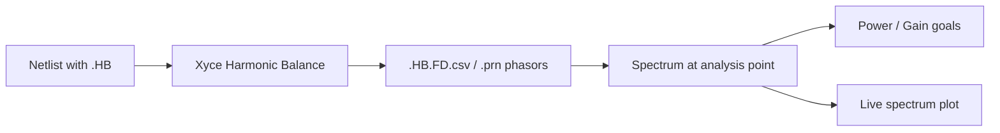

# Harmonic Balance

S-parameters describe only small-signal behavior. For large-signal design — power amplifiers, mixers, or any circuit where compression and mixing products matter — COBRA can optimize against a Harmonic Balance (`.HB`) analysis instead of, or together with, the `.AC` sweep.

HB returns the steady-state spectrum at a chosen point in the circuit: how much power sits at which frequency. That makes it the basis for output-power, gain, and isolation goals.



## Netlist Requirements

A Qucs-S schematic containing a Harmonic Balance simulation block exports the three directives COBRA needs:

```spice
.options hbint numfreq=3 STARTUPPERIODS=2
.HB 130G
.PRINT hb format=csv I(VOut) v(Out) v(Vdd) v(ip) v(on) v(op) v(sub)
```

| Directive | Meaning |
|-----------|---------|
| `.HB` | Fundamental frequencies. A single token is single-tone; several tokens make the analysis multi-tone. |
| `.options hbint numfreq=…` | Harmonics per fundamental. A list such as `numfreq=4,40` assigns a different count to each tone. |
| `.PRINT hb …` | Signals written to the result file — this determines which analysis points are available. |

Single-tone is appropriate whenever one signal is amplified:

```spice
.HB 130G
```

Multi-tone is required when signals actually mix, because Xyce then solves for all products $m \cdot f_1 + n \cdot f_2$:

```spice
.HB 95E9 10E9
```

!!! tip
    Both the `.HB` frequencies and the `.options hbint` values become editable fields under **Simulation Parameters** once a netlist is loaded, so harmonic settings can be adjusted without returning to the schematic.

## Analysis Points

Output power needs a voltage *and* a current. The Qucs-S convention is a labelled node with a 0 V source acting as a current probe in series with it:

```spice
VOut Out _net6 DC 0
```

This produces the pair `V(Out)` and `I(VOut)`. COBRA reads the `.PRINT hb` line and offers every node that has **both** halves of such a pair:

```python
from cobra.spice_sim.netlist_parsers.xyce_netlist_parser import XyceNetlistParser

parser = XyceNetlistParser().from_file("examples/Mixer/mixer_hb.cir")
parser.hb_probe_nodes
# ['IF_neg', 'IF_pos', 'LO_CM', 'LO_in', 'LO_neg', 'LO_pos', 'Out',
#  'RF_CM', 'RF_M_n', 'RF_M_p', 'RF_in', 'RF_neg', 'RF_pos']
```

In the GUI this list populates the **HB Analysis Point** dropdown in the configuration panel. The selected node is what both the HB design parameters and the spectrum plot refer to.

!!! warning
    A node that is only printed as a voltage cannot carry a power or gain goal, because the probe current is missing. Add the corresponding current probe in Qucs-S if a node needs to be evaluated.

## Power and Gain

Xyce stores HB results as two-sided phasors, so every spectral line holds *amplitude / 2*. The apparent power at an analysis point is therefore:

$$S = V_\mathrm{rms} \cdot I_\mathrm{rms} = 2 \cdot \lvert V_\mathrm{pk} \cdot I_\mathrm{pk} \rvert$$

$$P[\mathrm{dBm}] = 10 \cdot \log_{10}\!\left(\frac{2 \cdot \lvert V_\mathrm{pk} \cdot I_\mathrm{pk} \rvert}{1\,\mathrm{mW}}\right)$$

Because the real probe current is used instead of an assumed load resistance, the result stays valid for arbitrary and reactive loads, not just 50 Ω.

Gain additionally needs the drive level. It is derived from the SIN source of the port nominated as the input, using its amplitude $A$ and port impedance $z_0$ from the netlist:

$$P_\mathrm{avail} = \frac{A^2}{8 \cdot z_0} \qquad\qquad G[\mathrm{dB}] = P_\mathrm{out}[\mathrm{dBm}] - P_\mathrm{in}[\mathrm{dBm}]$$

For the port line `P2 _net28 0 port=1 z0=100 AC 0.089442719 SIN 0 0.089442719 130G` this yields $P_\mathrm{in} = 10\,\mu\mathrm{W} = -20$ dBm.

## Design Goals

Loading a netlist with an HB analysis adds two families of design parameters, named after the nodes and ports actually present in the circuit:

| Parameter | Description |
|-----------|-------------|
| `Power_dBm[<node>]` | Output power in dBm at the analysis point |
| `Gain_dB[<port>@<node>]` | Transducer gain in dB at `<node>`, referred to the drive level of input port `<port>` |

A goal targets one spectral line by giving a single frequency, or a band by giving a range:

=== "Single line"

    ```text
    Power_dBm[Out] > 10 dB   @ 35ghz
    ```

    Min and max frequency are set to the same value. The nearest spectral line is selected, matching `scikit-rf` slicing behavior.

=== "Frequency band"

    ```text
    Power_dBm[Out] < -30 dB  @ 100-160ghz
    ```

    Every HB line inside the band contributes to the penalty — useful for suppressing unwanted mixing products.

### Scripting Example

```python
from cobra.optimizers.design_goal import DesignGoal
from cobra.optimizers.design_goal_collection import make_power_dbm, make_gain_db
from cobra.spice_sim.netlist_parsers.xyce_netlist_parser import XyceNetlistParser

parser = XyceNetlistParser().from_file("examples/Mixer/mixer_hb.cir")
node = "Out"
port = parser.port_sources["P1"]          # {'z0': 100.0, 'sin_amplitude': 0.28284271, ...}

goals = [
    # IF output power at the 35 GHz difference frequency
    DesignGoal(
        parameter=make_power_dbm(node),
        frequency_range="35ghz",
        min_value=-20.0,
    ),
    # Conversion gain referred to the LO/RF drive on P1
    DesignGoal(
        parameter=make_gain_db("P1", port["sin_amplitude"], port["z0"], node),
        frequency_range="35ghz",
        min_value=6.0,
    ),
]
```

### Combining HB and S-Parameter Goals

AC and HB goals may be mixed in one run. COBRA determines which analyses the goals require, generates one netlist per analysis type, runs them, and combines the resulting penalties into a single loss:

$$L = \sum_i w_i \cdot p_i$$

If a goal needs an analysis the netlist does not contain, the missing directive is injected automatically — including a matching `.PRINT HB format=csv` line, without which Xyce would produce no HB output at all.

!!! note
    This is what makes a typical mixer specification expressible in one optimization: `S11` matching from the `.AC` sweep, conversion gain and mixing-product isolation from the `.HB` spectrum.

## Spectrum Visualization

During optimization the visualization panel plots the spectrum at the selected analysis point as a stem plot, updated every iteration.

| Quantity | Requires | Y axis |
|----------|----------|--------|
| Power | `V(node)` and `I(Vnode)` | dBm |
| Gain | `V(node)`, `I(Vnode)` and an input port | dB |
| Voltage | `V(node)` | dBV |
| Current | `I(Vnode)` | dBmA |

- **Fundamentals** are drawn in a distinct color from the remaining lines.
- **Clicking a line** places a marker labelled with its frequency, value, and harmonic index — `H2` for single-tone, or the mixing-product decomposition such as `2f1-f2` for multi-tone.
- When both an `.AC` and an `.HB` analysis run, a selector switches the left plot between S-parameters and the HB spectrum. When only one of them is active, that plot is shown and the selector is disabled.

The mixing-product labels are the practical tool for isolation work: they identify which unwanted product a given line belongs to while the optimizer is running.

## Worked Example: Mixer

`examples/Mixer/mixer_hb.cir` is a downconverting mixer:

| Signal | Frequency |
|--------|-----------|
| RF input | 130 GHz |
| LO input | 95 GHz |
| IF output (target) | 35 GHz |

The simulation does not use 130 GHz and 95 GHz as fundamentals. It uses `.HB 95E9 10E9` with `numfreq=4,40`, so the coarse 95 GHz tone and a fine 10 GHz grid together resolve 130 GHz and 35 GHz with enough mixing products. The lower fundamental carries far more harmonics precisely because the frequency resolution there is not oversampled.

Alongside the wanted difference frequency, the sum frequency (225 GHz) and higher products such as `2f_LO - f_RF` appear. Constraining them is an isolation goal: every line other than the target should sit a defined margin below it.

## Result Files

HB runs add the frequency-domain table to the timestamped results folder:

```text
results/<timestamp>_<name>/
├── <netlist>.HB.FD.csv     # or .HB.FD.prn, depending on the .PRINT format
└── …
```

Columns follow the Xyce convention `FREQ`, `Re(V(OUT))`, `Im(V(OUT))`, `Re(I(VOUT))`, `Im(I(VOUT))`, … and contain both the negative and positive halves of the two-sided spectrum. COBRA evaluates the non-negative half.

## Limitations

!!! note
    Transient (`.TRAN`) analyses are parsed and can be simulated, but time-domain spectrum plotting is not implemented yet. Use `.HB` to obtain a spectrum.

- A node needs both a voltage label and a current probe to support power or gain goals.
- Which frequencies are mixed, and how many harmonics per fundamental are considered, depends on the circuit and must be specified by the user — the tool cannot infer them.
