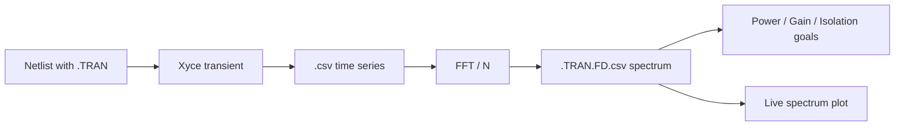

# Transient Analysis

A transient (`.TRAN`) analysis is the second way COBRA obtains a large-signal spectrum. Where [Harmonic Balance](harmonic-balance.md) solves for the periodic steady state directly, transient integrates the circuit in time; COBRA then takes the FFT of the settled part of the waveform. From that point on both analyses are identical: the same phasor convention, the same power formula, the same goals and the same plot.



Transient is the analysis to reach for when HB does not converge, when the circuit is driven by tones that are not harmonically related, or when the time-domain behaviour itself matters.

## Netlist Requirements

A Qucs-S schematic with a transient simulation block exports the two directives COBRA needs:

```spice
.tran 1.001e-12 1e-09 0 1.001e-12
.PRINT tran format=csv I(VOut) v(Out) v(Vdd) v(ip) v(on) v(op) v(sub)
```

| Directive | Meaning |
|-----------|---------|
| `.TRAN <step> <stop_time> [<start_time> [<max_step>]]` | Time integration. Output is written from `start_time` to `stop_time`. |
| `.PRINT tran format=csv …` | Signals written to the result file — this determines which analysis points are available. |

!!! warning "Use `format=csv`"
    Qucs-S exports `.PRINT tran format=raw file=…` by default. COBRA does not read the raw format; change the line to `format=csv` (or drop `format=` for Xyce's default table). `cobra parse` warns about a raw `.PRINT` line.

All four `.TRAN` arguments are editable under **Simulation Parameters** once the netlist is loaded.

## Choosing the Window

Xyce integrates from $t = 0$ but only prints from `start_time` on, so `start_time` is the settling time: everything before it — the start-up transient — never reaches the FFT. The printed window `stop_time − start_time` then determines the spectrum:

- The frequency resolution is $1 / (\text{stop\_time} - \text{start\_time})$. A 1 ns window gives 1 GHz bins.
- The window should hold a **whole number of periods** of every tone of interest. The FFT is not windowed, because a whole number of periods leaves no leakage and a window would only smear energy into neighbouring bins.
- A goal frequency must land on a bin. `cobra parse` warns when it does not.

For the mixer example the choice is:

```json
".TRAN": { "step": "1p", "stop_time": "2n", "start_time": "1n", "max_step": "1p" }
```

One nanosecond to settle, one nanosecond of signal: 35 GHz, 95 GHz and 130 GHz all fall exactly on 1 GHz bins.

!!! tip
    Start with a generous `start_time` and shorten it while the goal values stay put: once they stop changing, the circuit was already settled.

Xyce prints at the time steps its integrator actually took, which are neither exactly `step` nor perfectly uniform. COBRA interpolates the samples onto a uniform grid before the FFT, so the `step` argument only sets the initial step, and `max_step` the ceiling.

## From Waveform to Spectrum

The one-sided FFT is divided by the sample count, so every bin holds *amplitude / 2* — the same two-sided phasor convention Xyce uses for HB — and the DC bin holds the mean. The result is written next to Xyce's output as `<netlist>.TRAN.FD.csv` with the HB column layout (`FREQ`, `Re(V(OUT))`, `Im(V(OUT))`, …), and the [power, gain and isolation formulas](harmonic-balance.md#power-and-gain) apply unchanged:

$$P[\mathrm{dBm}] = 10 \cdot \log_{10}\!\left(\frac{2 \cdot \lvert V_\mathrm{pk} \cdot I_\mathrm{pk} \rvert}{1\,\mathrm{mW}}\right)$$

```python
import pandas as pd
from cobra.spice_sim import hb_spectrum, tran_spectrum

waveform = pd.read_csv("results/<run>/mixer_tran.cir.csv")
spectrum = tran_spectrum.to_frequency_domain(waveform)
freqs, p_dbm = hb_spectrum.spectrum(spectrum, "OUT", "power", (35e9, 35e9))
```

## Analysis Points and Design Goals

Analysis points follow the [HB convention](harmonic-balance.md#analysis-points): a node needs both `V(node)` and the current `I(Vnode)` of a 0 V probe source in its `.PRINT tran` line. `XyceNetlistParser.probe_nodes` lists them for either analysis.

The transient goals are the HB goals with a `TRAN:` prefix, so both can coexist in one run:

| Parameter | Description |
|-----------|-------------|
| `TRAN:Power_dBm[<node>]` | Output power in dBm at the analysis point |
| `TRAN:Gain_dB[<port>@<node>]` | Transducer gain in dB, referred to the drive level of input port `<port>` |
| `TRAN:Isolation_dB[<node>]` | Margin in dB between the target line and the strongest other line |

In a configuration file the analysis is stated explicitly next to `kind`:

```json
{
  "parameter": "TRAN:Isolation_dB[Out]",
  "frequency_range": "35GHz",
  "min_value": 30.0,
  "kind": "isolation_db",
  "node": "Out",
  "analysis": "TRAN"
}
```

`analysis` defaults to `"HB"`, so existing configurations are unchanged. In the GUI, both families appear in the goal dialog; the netlist's own analysis is listed first.

### Scripting Example

```python
from cobra.optimizers.design_goal import DesignGoal
from cobra.optimizers.design_goal_collection import make_isolation_db, make_power_dbm
from cobra.spice_sim.simulation_type import SimulationType

goals = [
    DesignGoal(make_power_dbm("Out", SimulationType.TRAN), "35ghz", min_value=-20.0),
    DesignGoal(make_isolation_db("Out", SimulationType.TRAN), "35ghz", min_value=30.0),
]
```

If a goal needs a `.TRAN` analysis the netlist does not contain, COBRA injects one from the `.TRAN` simulation parameters together with a `.PRINT TRAN format=csv` line for every probe node — exactly as it does for HB.

## Spectrum Visualization

The transient spectrum uses the same stem plot as HB, selected through the **Plot** dropdown as *Transient Spectrum* when the run produces it. Quantity selection, gain reference port and click-to-mark behave identically.

The fundamentals used to colour and label the lines are the SIN frequencies of the driven ports, highest first: for the mixer (`P2` at 130 GHz, `P1` at 95 GHz) the IF line is labelled `f1-f2`. Because an FFT has a bin at every multiple of the resolution, labels are limited to mixing products up to fifth order so noise-floor bins are not dressed up as far-fetched products.

## Worked Example: Mixer

`examples/configs/mixer_tran_config.json` optimizes the same down-converting mixer as the HB example, on `examples/netlists/Mixer/mixer_tran.cir`, with a conversion-gain goal and an isolation goal at the 35 GHz IF. Run it headless with

```bash
cobra run examples/configs/mixer_tran_config.json
```

## Result Files

```text
results/<timestamp>_<name>/
└── trials/trial_<n>/
    ├── <netlist>.csv           # Xyce time series (TIME, V(OUT), I(VOUT), …)
    ├── <netlist>.TRAN.FD.csv   # spectrum derived by COBRA, HB column layout
    └── …
```

## Limitations

- Only the spectrum of the settled window is evaluated; there are no time-domain goals (settling time, overshoot) yet.
- The waveform itself is not plotted in the GUI — only its spectrum.
- Choosing a window that holds whole periods of every tone is up to the user; COBRA checks the goal frequencies against the resulting grid but cannot pick the window.
