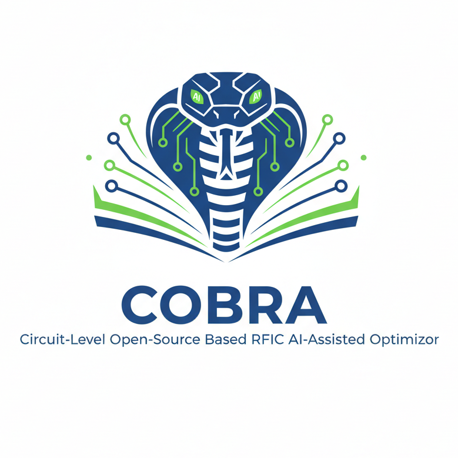
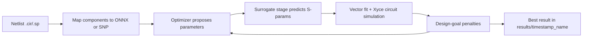

# COBRA: An AI-Assisted Circuit-Level Optimizer for Open Source Based RFIC Design

	
	

		COBRA (Circuit-Level Open-Source Based RFIC AI-Assisted Optimizer) accelerates RFIC circuit optimization by
		combining surrogate model inference, SPICE simulation, and goal-driven optimization in one workflow.
	

	

		
Authors

		

			<a href="https://orcid.org/0009-0002-6315-1538">Gianluca Simone</a>,
			<a href="https://orcid.org/0009-0003-6526-5464">David Lurz</a>,
			<a>Martin Grund</a>,
			<a>Fabian Schneider</a>,
			<a href="https://orcid.org/0000-0002-8422-5391">Michael Loose</a>,
			<a href="https://orcid.org/0000-0002-9600-2988">Sascha Breun</a>,
			<a href="https://orcid.org/0009-0002-7827-7205">Manuel Koch</a>,
			<a href="https://scholar.google.com/citations?user=74ugHPcAAAAJ&hl=de">Robert Weigel</a>,
			<a href="https://orcid.org/0000-0002-2777-4722">Norman Franchi</a>
		

	

	

		
Published

		
SBCCI 2026 (conference contribution)

	

## Main Capabilities

- Mixed component sources in one run: ONNX surrogates and fixed SNP files.
- Goal-based optimization with Optuna samplers/pruners.
- Design metrics for S-parameters and RF lumped quantities (e.g. L, R, Q, coupling).
- Optional EM fine-tuning loop through Palace + ORCA geometry.
- GUI workflow and script-first workflow.

## Start Here

- New users: go to **Getting Started -> Installation**.
- First successful run: **Getting Started -> Quickstart**.
- API details: **API Reference**.

## Core Concepts

COBRA optimizes circuit behavior using a staged loop that combines surrogate prediction and SPICE simulation.

### Optimization Workflow

### Goals and Parameter Types

- A design goal is a bound on one metric (for example S11, S21, L, Q, k), optionally in a frequency range such as `125-135ghz`.
- `MODEL_INPUT` parameters control ONNX surrogate inputs (example: `X1:bottom_winding_diameter`).
- `NETLIST_VARIABLE` parameters patch parsed netlist values directly (example: `Cshunt_p`).
- Linked parameters (`linked_to`) enforce symmetry/constraints by mirroring values.

Penalties are aggregated as:

$$L = \sum_i w_i \cdot p_i$$

where $p_i$ is each goal penalty and $w_i$ is the goal weight.

## Inputs and Outputs

=== "Inputs"

		- Circuit netlist from Qucs-S/Xyce format.
		- Component models (`.onnx` and/or `.sNp`).
		- Design goals and optimization parameter definitions.

=== "Outputs"

		- Timestamped folder in `results/`.
		- Predicted and surrogate S-parameter files.
		- Vector-fitted SPICE subcircuits.
		- Full optimization context JSON.

## Related Projects

- ORCA creates surrogate models that COBRA consumes.
- Palace can be used for optional full-wave EM fine-tuning.

---

If you use COBRA in research, see citation information in the repository README.