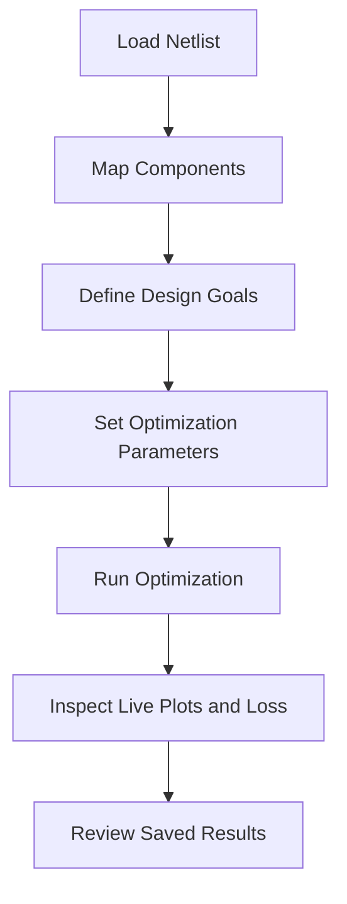

# GUI Mode

The COBRA GUI is launched with:

```bash
cobra
```

## What You Can Configure

- Netlist source
- Component-to-model mapping (`.onnx` or `.sNp`)
- Design goals (S-parameter and RF metrics)
- Analysis point, when the run includes a Harmonic Balance or transient analysis
- Optimization parameters and ranges
- Iteration control and stop behavior
- Parallelism: either N independent trials or one N-rank MPI simulation
- Optional fine-tuning settings

## Appearance

The GUI ships two themes: **Sandbank** (light) and **Deepwater** (dark). By
default it follows the operating system's colour scheme and switches live when
the system changes. The theme button in the top-right corner cycles through
*system → light → dark*; the choice is stored in the COBRA settings
(`appearance/mode`) and restored on the next start.

## Typical GUI Flow



## Parallelism

The **Parallelism** row offers one choice and one process count:

- **Independent trials** — the recommended mode. `Processes` trials are
  evaluated at the same time, each in its own single-core simulation. This is
  saved as `parallel_trials`.
- **Parallel simulator (MPI)** — one trial at a time, each simulation on
  `Processes` MPI ranks (`parallel_xyce` and `parallel_xyce_processes`). Only
  worthwhile for very large netlists; it needs an MPI-enabled Xyce build.

The two modes compete for the same cores, so the GUI never enables both. A
configuration file that sets `parallel_trials` above 1 *and* `parallel_xyce`
is rejected when loaded into the GUI; headless runs still accept it with a
warning.

## Design Goals in Practice

Use goal constraints with optional frequency ranges, for example:

- S11 <= -9 dB in `125-135ghz`
- -3 dB <= S21 <= 0 dB in `125-135ghz`
- `Power_dBm[Out]` >= 10 dB at `35ghz` (single spectral line of an HB run)

The goal dialog groups the parameters by the analysis that produces them (`.AC`, `.HB`, `.TRAN`) in a tab bar at the top; the netlist's own analysis is opened first, and a goal from another tab adds that analysis to the run. Below, the dialog offers the inputs the selected parameter takes: choose *Whole sweep / spectrum*, *Single frequency* (the nearest frequency of the sweep or spectral line is used) or *Frequency range*. Goals that only make sense one way are restricted accordingly — an isolation goal, for example, has no max value and always targets a single frequency.

!!! note
    Goals are transformed into penalty values. Satisfying goals yields zero or negative penalty (reward), violations increase positive penalty.

## Parameter Types

- `MODEL_INPUT`: geometry/model inputs for ONNX surrogate components.
- `NETLIST_VARIABLE`: parsed netlist values patched directly in netlist text.

## During Optimization

The GUI displays:

- live S-parameter traces,
- the HB or transient output spectrum at the selected analysis point, as power, gain, voltage or current,
- per-goal penalty/loss behavior,
- current and best trial values,
- progress against maximum iterations. The progress bar turns amber while the
  run is paused and green once it has finished; the status bar reports the end
  of the run.

When a run produces more than one of the S-parameter, HB and transient plots, a selector switches the left plot between them. See **Advanced -> Harmonic Balance** for the spectrum markers and mixing-product labels, and **Advanced -> Transient Analysis** for the FFT window.

## Outputs

Results are stored in a timestamped folder under `results/` and include generated surrogate/predicted touchstone files, SPICE subcircuits, and run context.
