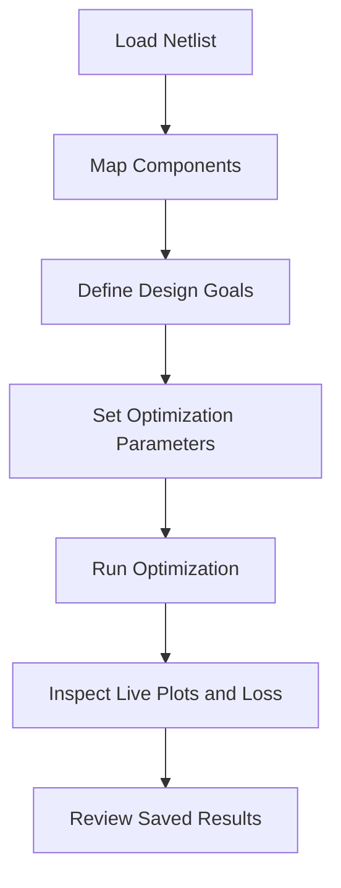

# GUI Mode

The COBRA GUI is launched with:

```bash
cobra
```

## What You Can Configure

- Netlist source
- Component-to-model mapping (`.onnx` or `.sNp`). Hover over the model field to see what
  an ONNX model declares: its band, trained ranges, feasibility constraints and guarantees
- Simulator: `XyceSimulator` or `VacaskSimulator`. The netlist dialog accepts
  `*.sim`, `*.scs` and `*.spectre` files besides SPICE netlists. Switching the
  simulator re-reads the loaded netlist with that simulator's parser, and the goal
  list offers only goals the selected simulator can run (e.g. `NF` for VACASK)
- Subcircuit surrogate: the "Subcircuit surrogate" row lists the netlist's
  subcircuits as "name (N pins)"; **Use as surrogate** adds a model row for the
  selected one (its instances are replaced, see
  [VACASK Simulator](../advanced/vacask.md#style-2-xschem-netlists)) and
  **Clear** removes the selection. Loading a configuration restores subcircuit
  surrogates
- Design goals (S-parameter and RF metrics)
- Analysis point, when the run includes a Harmonic Balance or transient analysis
- Optimization parameters and ranges
- Iteration control and stop behavior
- Parallelism: either N independent trials or one N-rank MPI simulation
- Optional fine-tuning settings

## Appearance

The GUI ships two themes: **Sandbank** (light) and **Deepwater** (dark). By
default it follows the operating system's colour scheme and switches live when
the system changes. The theme button in the top-right corner cycles through
*system → light → dark*; the choice is stored in the COBRA settings
(`appearance/mode`) and restored on the next start.

## Typical GUI Flow


```mermaid
flowchart TD
    A[Load Netlist] --> B[Map Components]
    B --> C[Define Design Goals]
    C --> D[Set Optimization Parameters]
    D --> E[Run Optimization]
    E --> F[Inspect Live Plots and Loss]
    F --> G[Review Saved Results]
```

## Parallelism

The **Parallelism** row offers one choice and one process count:

- **Independent trials** — the recommended mode. `Processes` trials are
  evaluated at the same time, each in its own single-core simulation. This is
  saved as `parallel_trials`.
- **Parallel simulator (MPI)** — one trial at a time, each simulation on
  `Processes` MPI ranks (`parallel_xyce` and `parallel_xyce_processes`). Only
  worthwhile for very large netlists; it needs an MPI-enabled Xyce build.

The two modes compete for the same cores, so the GUI never enables both. A
configuration file that sets `parallel_trials` above 1 *and* `parallel_xyce`
is rejected when loaded into the GUI; headless runs still accept it with a
warning.

## Optimization Parameters

The parameter dialog sets a parameter's bounds, step, unit and link, and an
optional **Start value** (`initial_value`): the value the optimizer evaluates
first, for example a known design you want to retune. *None* lets the optimizer
choose. For an ONNX model input, the dialog takes the bounds, and the step of
an input such as whole turns, from the model's metadata.

The **Optimizer** row offers `OptunaOptimizer` (the default, a global search)
and `GradientDescentOptimizer`, a local search that runs one trial at a time.

## Design Goals in Practice

Use goal constraints with optional frequency ranges, for example:

- S11 <= -9 dB in `125-135ghz`
- -3 dB <= S21 <= 0 dB in `125-135ghz`
- `Power_dBm[Out]` >= 10 dB at `35ghz` (single spectral line of an HB run)

The goal dialog groups the parameters by the analysis that produces them (`.AC`, `.HB`, `.TRAN`) in a tab bar at the top; the netlist's own analysis is opened first, and a goal from another tab adds that analysis to the run. Below, the dialog offers the inputs the selected parameter takes: choose *Whole sweep / spectrum*, *Single frequency* (the nearest frequency of the sweep or spectral line is used) or *Frequency range*. Goals that only make sense one way are restricted accordingly — an isolation goal, for example, has no max value and always targets a single frequency.

!!! note
    Goals are transformed into penalty values. Satisfying goals yields zero or negative penalty (reward), violations increase positive penalty.

## Parameter Types

- `MODEL_INPUT`: geometry/model inputs for ONNX surrogate components.
- `NETLIST_VARIABLE`: parsed netlist values patched directly in netlist text.

## During Optimization

The GUI displays:

- live S-parameter traces,
- the HB or transient output spectrum at the selected analysis point, as power, gain, voltage or current,
- per-goal penalty/loss behavior,
- current and best trial values,
- progress against maximum iterations. The progress bar turns amber while the
  run is paused and green once it has finished; the status bar reports the end
  of the run.

When the run ends, the parameters, goals and plots switch to its final result:
the trial that met the goals or, if none did, the trial that missed them by the
least. The loss plot keeps one point per iteration, including the trials that
were still running when the run stopped.

When a run produces more than one of the S-parameter, HB and transient plots, a selector switches the left plot between them. See **Advanced -> Harmonic Balance** for the spectrum markers and mixing-product labels, and **Advanced -> Transient Analysis** for the FFT window.

## Outputs

Results are stored in a timestamped folder under `results/` and include generated surrogate/predicted touchstone files, SPICE subcircuits, and run context.
